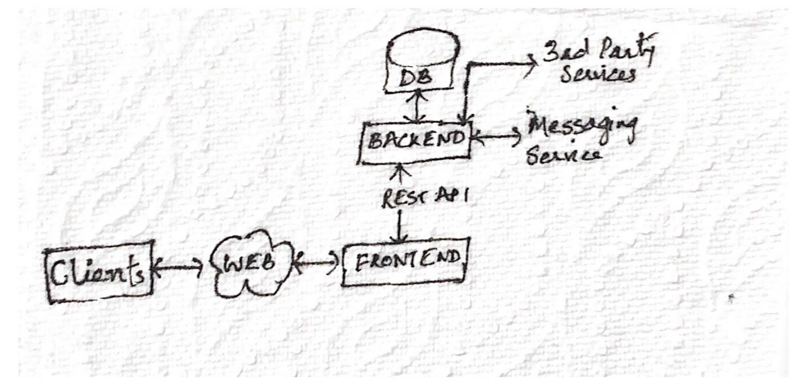
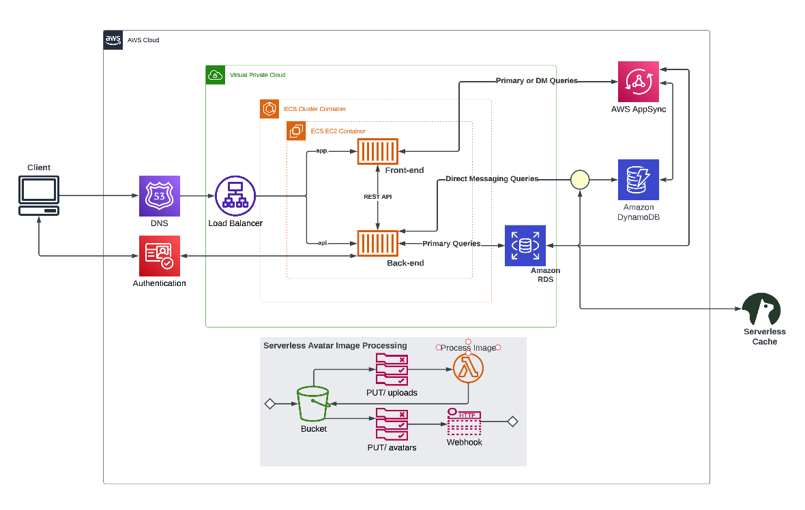
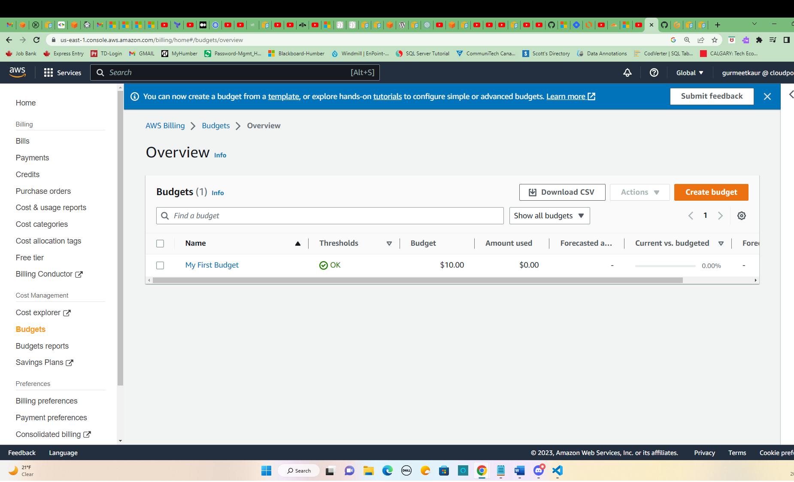
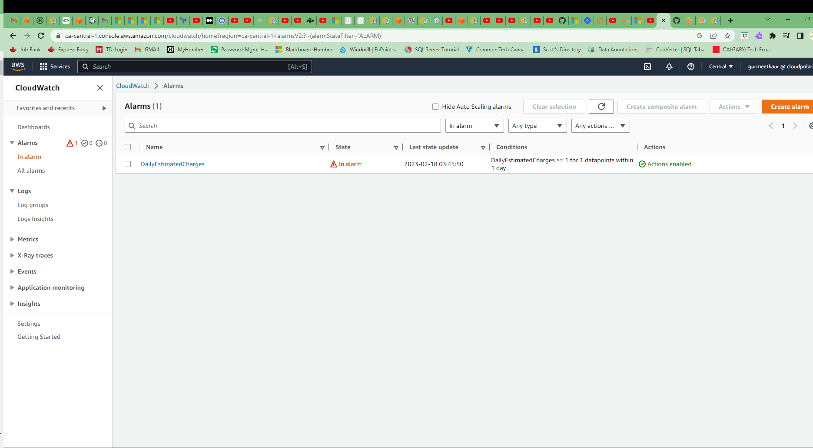

# Week 0 — Billing and Architecture

## Homework Summary & Pre-requisites
:thumbsup: Created conceptual architectural diagram (napkin design)

:thumbsup: Created new account for Lucid Charts and created logical architectural diagram

:thumbsup: Enabled MFA for the root user account

:thumbsup: Created IAM user account under 'Admin' user group

:thumbsup: Activated 'Role Access to Billing Information' for IAM user

:thumbsup: Generated AWS credentials - Create Access Key

:thumbsup: Installed the latest version of AWS CLI using gitpod workspace

:thumbsup: Created AWS Budget using AWS CLI commands

:thumbsup: Installed BFG Repo Cleaner

:thumbsup: Created new accounts to use Gitpod , Momento and Honeycomb applications

## Task 1 - Conceptual Diagram (Napkin Design)
Created conceptual architectural diagram for the application - to communicate at a high level the architecture to key stakeholders.



## Task 2 - Logical Architectural Diagram 
Recreated the logical architectural diagram of the application - to communicate the broad strokes of the technical architecture to engineers.

The link to Lucidcharts diagram file is - https://lucid.app/lucidchart/f57f0694-087c-4c82-9f14-afce5e294007/edit?viewport_loc=-220%2C106%2C3328%2C1582%2C0_0&invitationId=inv_caf2c24f-af28-4d89-bef8-d7e35d6ccca8



---

## Task 3 - Installing the latest version of AWS CLI 
To install the latest version of AWS CLI using gitpod workspace, modified the `.gitpod.yml` file in the project with the following configuration for Linux x86(64): 

```yml
tasks:
  - name: aws-cli
    env:
      AWS_CLI_AUTO_PROMPT: on-partial
    init: |
      cd /workspace
      curl "https://awscli.amazonaws.com/awscli-exe-linux-x86_64.zip" -o "awscliv2.zip"
      unzip awscliv2.zip
      sudo ./aws/install
      cd $THEIA_WORKSPACE_ROOT
...
```
**Detailed instructions may be found here** - [Installing or updating the latest version of the AWS CLI](https://docs.aws.amazon.com/cli/latest/userguide/getting-started-install.html)

:a: Configured the values of environment variables using following script-

```sh
export AWS_ACCOUNT_ID="111111111111"
export AWS_ACCESS_KEY_ID="EXAMPLEACCESSKEY"
export AWS_DEFAULT_REGION="region"
```
**Detailed instructions may be found here** - [Environment variables to configure the AWS CLI](https://docs.aws.amazon.com/cli/latest/userguide/cli-configure-envvars.html)

:b: Used the following commands to save the environment variables values inside the gitpod environment-
```sh
gp env AWS_ACCOUNT_ID="111111111111"
gp env AWS_ACCESS_KEY_ID="EXAMPLEACCESSKEY"
gp env AWS_DEFAULT_REGION="region"
```
These saved variables may be seen here - https://gitpod.io/user/variables or may be checked by using this terminal command- `aws sts get-caller-identity` inside the gitpod workspace.

---

## Task 4 - Create a Budget using AWS CLI 
Created a [Cost and Usage Budget](https://docs.aws.amazon.com/cli/latest/reference/budgets/create-budget.html#examples) using the AWS CLI commands.

Used the following commands create the budget-

```sh
aws budgets create-budget \
    --account-id "AWS_ACCOUNT_ID" \
    --budget file://budget.json \
    --notifications-with-subscribers file://budget-notifications-with-subscribers.json
```



---

## Task 5 - Create SNS Topic & Billing Alarm
We need to create a AWS Simple Notification Service (SNS) Tpoic with a subscriber first before we create an AWS Cloudwatch billing alarm. Created a SNS Topic using following command on AWS CLI-
`aws sns create-topic --name "my-topic-name"`

and it provided us with a TopicARN. Then, created a subscription by providing my email on which I want to receive billing alerts as follows-

```sh
aws sns subscribe \
    --topic-arn="TopicARN" \
    --protocol=email \
    --notification-endpoint=email@email.com
```
**More details may be found here** - [Setting up Amazon SNS notifications](https://docs.aws.amazon.com/AmazonCloudWatch/latest/monitoring/US_SetupSNS.html)




`aws cloudwatch put-metric-alarm --cli-input-json file://aws/json/alarm-config.json`

## Task 6 - Scrubbing Github History of Sensitive Data

Installed [BFG Repo-Cleaner](https://rtyley.github.io/bfg-repo-cleaner/) using the following install command-

`brew install bfg` from the [Homebrew Formulae](https://formulae.brew.sh/formula/bfg)

- [X] Using instructions form this [document](https://docs.github.com/en/authentication/keeping-your-account-and-data-secure/removing-sensitive-data-from-a-repository), ran the following commands to scrub sensitive data from git history-

```sh
cd workspace
git clone --mirror https://github.com/gurmeetkaur2/aws-bootcamp-cruddur-2023.git bootcamp
cd bootcamp/
bfg --replace-text passwords.txt
git reflog expire --expire=now --all && git gc --prune=now --aggressive
git push
```

## Additional topics learnt 
1. AWS Cloudshell 
2. AWS Billing Dashboard
    - Cost Allocation Tags
    - AWS Cost Management or Cost Explorer - to check cost/usage reports
    - Credits - used to redeem AWS credits
3. AWS Pricing Calculator
4. AWS Organizations
