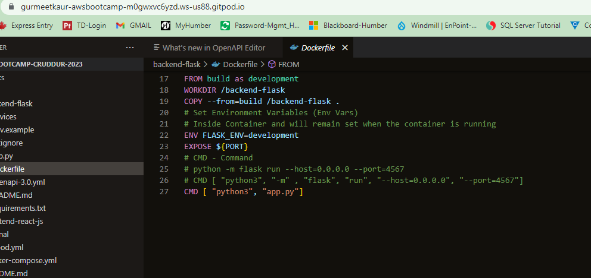
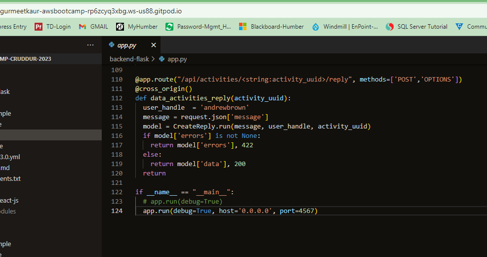
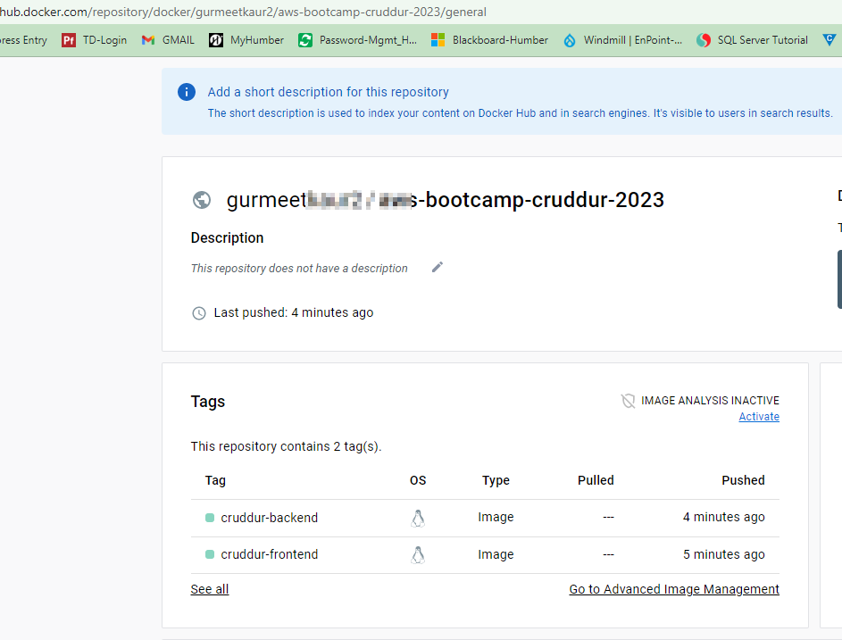
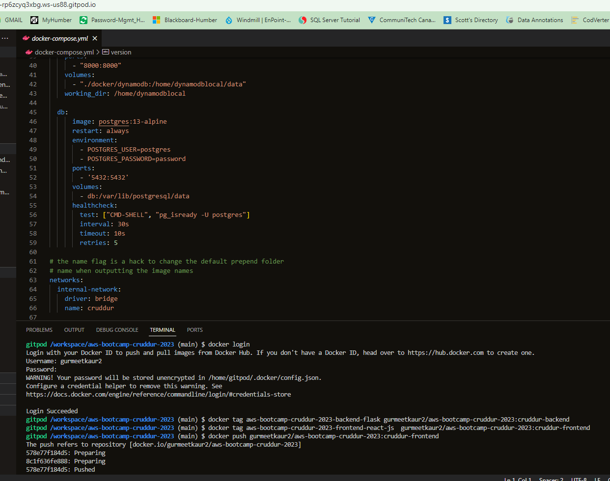
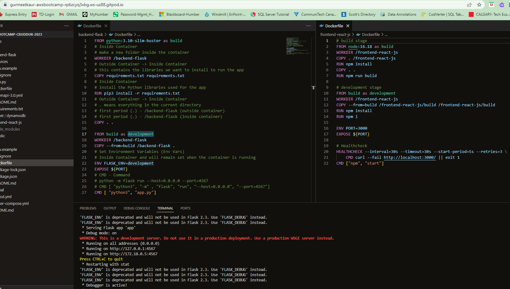
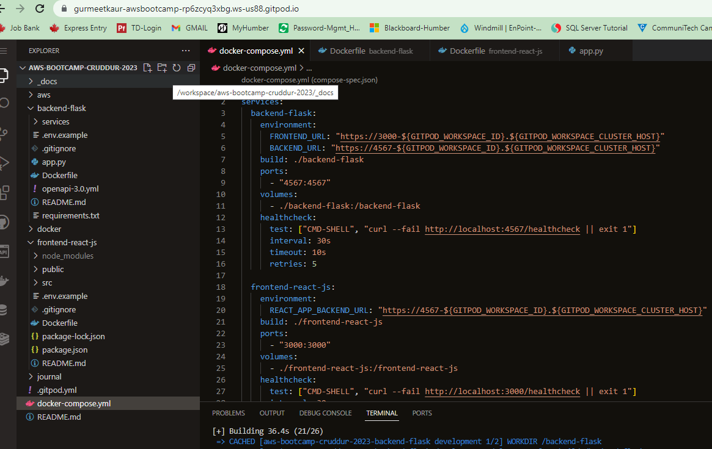
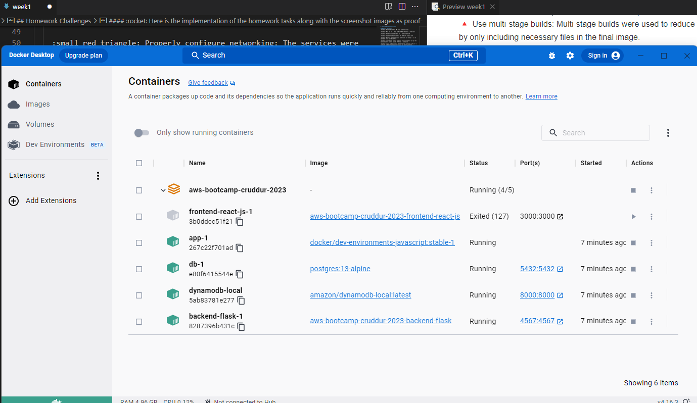
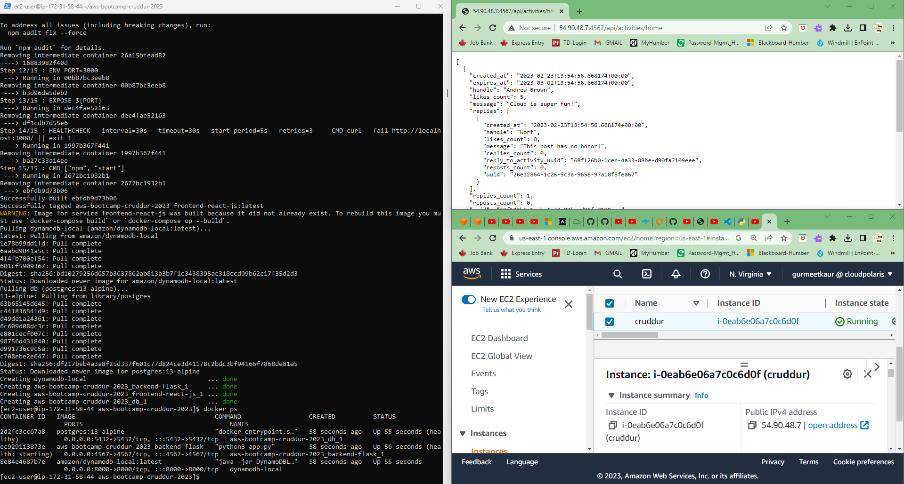

# Week 1 — App Containerization

## Homework Challenges    
:thumbsup: Run the dockerfile CMD as an external script

:thumbsup: Push and tag a image to DockerHub (they have a free tier)

:thumbsup: Use multi-stage building for a Dockerfile build

:thumbsup: Implement a healthcheck in the V3 Docker compose file

:thumbsup: Research best practices of Dockerfiles and attempt - [x] to implement it in your Dockerfile

:thumbsup: Learn how to install Docker on your localmachine and get the same containers running outside of Gitpod / Codespaces

:thumbsup: Launch an EC2 instance that has docker installed, and pull a container to demonstrate you can run your own docker processes. 

----
### :rocket: Here is the implementation of the homework tasks along with the screenshot images as proof-

1. I modified CMD instruction in backend `Dockerfile` to use `app.py` as an external script file.
2. I created dockerhub account and created repository to push the images to docker registry and used following commands to tag first and then push-

        ```
        docker tag aws-bootcamp-cruddur-2023-backend-flask gurmeet.../aws-bootcamp-cruddur-2023:cruddur-backend

        docker tag aws-bootcamp-cruddur-2023-frontend-react-js  gurmeet.../aws-bootcamp-cruddur-2023:cruddur-frontend

        docker push gurmeet.../aws-bootcamp-cruddur-2023:cruddur-frontend

        docker push gurmeet.../aws-bootcamp-cruddur-2023:cruddur-backend
        ```
3. I used multi-stage builds in `Dockerfile` for both frontend and backend. (_**A little troubleshooting required to fix backend-flask container env variable development/production warning_)
4. I implemented healthchecks in `docker-compose.yml` and `Dockerfile` files
5. I researched Docker best practices and tried to implement the following in the code:
    
    :small_red_triangle: Use multi-stage builds: Multi-stage builds were used to reduce the image size and improve security by only including necessary files in the final image.

    :small_red_triangle: Minimize layers: The number of layers was minimized by chaining multiple commands together in a single RUN instruction.

    :small_red_triangle: Use the latest version of base images: The latest version of the base images was used to ensure that the application is running on a secure and up-to-date environment.

    :small_red_triangle: Use COPY instead of ADD: COPY command was used instead of ADD to only copy necessary files.

    :small_red_triangle: Use environment variables: Environment variables were used to make the application more flexible and configurable.

    :small_red_triangle: Use volumes for data persistence: Volumes were used to persist data outside of the container, allowing for easy backups and restores.

    :small_red_triangle: Implement a health check: A health check was implemented to allow the container to be monitored and to restart automatically if necessary.

    :small_red_triangle: Properly configure networking: The services were properly configured to communicate with each other using the internal network driver.

    :small_red_triangle: Use separate containers for each service: Each service was run in a separate container, making it easier to manage and scale the application.

    :small_red_triangle: Use official images: Official images were used whenever possible to ensure that the images were up-to-date, secure, and supported by the community.

    :small_red_triangle: Use Docker Compose for complex deployments: Use Docker Compose to manage complex multi-container deployments. This makes it easy to manage the entire deployment as a single unit.

6. I installed docker desktop using instructions from [Docker Desktop for Windows](https://docs.docker.com/desktop/install/windows-install/), on my laptop and cloned the git repository to run the same containers in Docker Desktop. (_**A little troubleshooting required to fix frontend-react-js container issue_)
7. I launched an EC2 instance, connected to EC2 with SSH, installed docker, docker compose, git cloned the project repo, and run the `docker-compose up -d` that started all the containers in the app. I updated security group in EC2 to allow incoming requests on the ports used by the containers and the docker compose app got successfully deployed. Used a few online resources for help-
      >[How to Deploy a Multi Container Docker Compose Application On Amazon EC2](https://everythingdevops.dev/how-to-deploy-a-multi-container-docker-compose-application-on-amazon-ec2/)
      >
      >[How to install Git on AWS EC2 Amazon Linux 2](https://www.how2shout.com/linux/how-to-install-git-on-aws-ec2-amazon-linux-2/)
      >
      >[Installing Docker to use with the AWS SAM CLI](https://docs.aws.amazon.com/serverless-application-model/latest/developerguide/install-docker.html)
      >
      >[How to install Docker on Amazon Linux 2](https://www.cyberciti.biz/faq/how-to-install-docker-on-amazon-linux-2/)

      ```sh
      # Some Common commands used to connect to EC2 and install docker services
      
      ssh -i C:\Users\gurme\Downloads\key-pair.pem ec2-user@ec2-54-90-48-7.compute-1.amazonaws.com

      sudo yum update -y
      sudo amazon-linux-extras install docker
      sudo service docker start

      sudo yum install git
      git version

      sudo yum install docker
      docker --version

      # For Docker-Compose installation
      # 1. Get pip3 
      sudo yum install python3-pip
      
      # 2. Then run any one of the following
      sudo pip3 install docker-compose # with root access
      # OR #
      pip3 install --user docker-compose # without root access for security reasons

      # Getting docker version info on Amazon EC2-
      # The docker-compose is installed in ‘/usr/local/bin’ directory 
      # To see current PATH settings run the following command:
      echo "$PATH"
      
      # To add /usr/local/bin/ path to your bash startup file such as ~/.profile or ~/.bash_profile using the export command:
      export PATH=$PATH:/usr/local/bin

      # Another option for developers is to use the find command to locate the docker-compose file as follows:
      sudo find / -name "docker-compose" -ls

      git clone --git-repository-link

      # Finally,
            docker-compose up -d
      ```

      
8. I learnt about the top 10 Docker Security Best Practices watching Security Consideration video of week 1

    :small_red_triangle: Keep host and docker updated to latest security patches

    :small_red_triangle: Docker dwemon & containers should run in non-root user mode

    :small_red_triangle: Image vulnerability scanning ([Amazon Inspector](https://aws.amazon.com/inspector/), [Clair]( https://github.com/quay/clair), [Snyk Container Security]( https://snyk.co/cloudbootcamp))

    :small_red_triangle: Trusting a private vs public image registry

    :small_red_triangle: No sensitive data in docker files or images

    :small_red_triangle: Use secret management services to share secrets ([AWS Secret Manager]( https://aws.amazon.com/secrets-manager/), Hashicorp Vault)

    :small_red_triangle: Read only file system and volume for docker

    :small_red_triangle: Separate databases for long term storage

    :small_red_triangle: Use DevSecOps practices while building application security

    :small_red_triangle: Ensure all code is tested for vulnerabilities before production use
    
## Homework Samples (Images)-

**Image 1 - Dockerfile - Updated CMD to use app.py as external script-->**


**Image 2 - App.py - code-update to make it external script-->**



**Image 3 - Docker Registry Repo- Pushed images to DockerHub-->**



**Image 4 - Commands to commit and push images to Docker Registry-->**



**Image 5 - Dockerfile - showing Multi Stage Build code-update-->**



**Image 6 - Healthchecks- Docker-compose.yml code-update-->**



**Image 7 - Launched Multi Container App in Docker Desktop-->**



**Image 8 - Launched Docker Compose App in EC2-->**



## :dart:Resources
The following steps were provided during the live stream training to containerize the application by [Andrew Brown](https://github.com/omenking/aws-bootcamp-cruddur-2023/blob/week-1/journal/week1.md)

## Containerize Backend-
#### Run Python
```sh
cd backend-flask
export FRONTEND_URL="*"
export BACKEND_URL="*"
python3 -m flask run --host=0.0.0.0 --port=4567
cd ..
```

- Unlock the port on the port tab in Gitpod
- Open the link for port 4567
- Append /api/activities/home to the URL
- JSON should return in the browser

#### Add Dockerfile
Create a file in backend-flask named Dockerfile

```dockerfile
FROM python:3.10-slim-buster

WORKDIR /backend-flask

COPY requirements.txt requirements.txt
RUN pip3 install -r requirements.txt

COPY . .

ENV FLASK_ENV=development

EXPOSE ${PORT}
CMD [ "python3", "-m" , "flask", "run", "--host=0.0.0.0", "--port=4567"]
```

#### Build Container
```sh
docker build -t backend-flask ./backend-flask
```

Note: -t stands for tag. This flag will name the image, and provides the option for a tag in the format of 'name:tag'

- Docker will default to 'latest' tag but this is a default and doesn't necessarily mean it's the latest image.
- Treat 'latest' as a default tag.

#### Run Container
```sh
docker run --rm -p 4567:4567 -it backend-flask
FRONTEND_URL="*" BACKEND_URL="*" docker run --rm -p 4567:4567 -it backend-flask
export FRONTEND_URL="*"
export BACKEND_URL="*"
docker run --rm -p 4567:4567 -it -e FRONTEND_URL='*' -e BACKEND_URL='*' backend-flask
docker run --rm -p 4567:4567 -it  -e FRONTEND_URL -e BACKEND_URL backend-flask
unset FRONTEND_URL="*"
unset BACKEND_URL="*"
```

NOTE: The above code is from the instructions however, I had to set BACKEND_URL & FRONTEND_URL to both ="*" before running docker run --rm -p 4567:4567 -it -e FRONTEND_URL='*' -e BACKEND_URL='*' backend-flask.


Run the following:

```sh
set BACKEND_URL="*"
set FRONTEND_URL="*"
docker run --rm -p 4567:4567 -it -e FRONTEND_URL='*' -e BACKEND_URL='*' backend-flask
```

NOTE: Navigate to the URL with /api/activities/home appended. 
- unset was not needed to removed the frontend & backend var.


Run in background
```sh
docker container -run --rm -p 4567:4567 -d backend-flask
```

Return the container id into an Env Var
```sh
CONTAINER_ID=$(docker run --rm -p 4567:4567 -d backend-flask)
```

> docker container run is idiomatic, docker run is legacy syntax but is commonly used.


## Containerize Frontend-
#### Install NPM
```
cd frontend-react-js
npm i
```

NOTE: if this returns an error, wait a moment and try again. Otherwise, check to ensure you're in the correct directory.

#### Create Dockerfile
Create a new Dockerfile in the frontend-react-js directory:
```dockerfile
FROM node:16.18

ENV PORT=3000

COPY . /frontend-react-js
WORKDIR /frontend-react-js
RUN npm install
EXPOSE ${PORT}
CMD ["npm", "start"]
```

#### Run Frontend Container
```sh
docker run -p 3000:3000 -d frontend-react-js
```

## Multiple Containers
#### Create `docker-compose.yml` in the root directory.

[Docker Compose Documentation](https://docs.docker.com/compose/gettingstarted/)

```yaml
version: "3.8"
services:
  backend-flask:
    environment:
      FRONTEND_URL: "https://3000-${GITPOD_WORKSPACE_ID}.${GITPOD_WORKSPACE_CLUSTER_HOST}"
      BACKEND_URL: "https://4567-${GITPOD_WORKSPACE_ID}.${GITPOD_WORKSPACE_CLUSTER_HOST}"
    build: ./backend-flask
    ports:
      - "4567:4567"
    volumes:
      - ./backend-flask:/backend-flask
  frontend-react-js:
    environment:
      REACT_APP_BACKEND_URL: "https://4567-${GITPOD_WORKSPACE_ID}.${GITPOD_WORKSPACE_CLUSTER_HOST}"
    build: ./frontend-react-js
    ports:
      - "3000:3000"
    volumes:
      - ./frontend-react-js:/frontend-react-js

# the name flag is a hack to change the default prepend folder
# name when outputting the image names
networks: 
  internal-network:
    driver: bridge
    name: cruddur
```

Right-click on `docker-compose.yml` file and click on Compose Up.
- Make sure you're in the root dir before you do this otherwise it may result in an error.
- You can also type in the following command:

```sh
docker compose up
```

## Additional topics learnt-

#### Some commands used for initial installations
```sh
pyenv install 3.10.9 (Install python version)
pyenv global 3.10.9 (Set your python version)
python -m venv venv (Create virual environment)
source venv/bin/activate (Activate virual  environment)
deactivate (Deactivate virual  environment)
pip install flask (Install Flask)
```

#### Alternate way to setup frontend & backend - update gitpod.yml as
```
- name: Initialize Frontend and Backend
    init: |
      cd /workspace/aws-bootcamp-cruddur-2023/backend-flask
      pip3 install -r requirements.txt
      cd /workspace/aws-bootcamp-cruddur-2023/frontend-react-js
      npm i    
```
#### A few commands to use initialize and use postgres on CLI
```postgres
psql -Upostgres --host localhost
postgres=#
\d
\t
\dl
\l
\q
```

## AWS Cloud Project Bootcamp - Training Video Links
[:o: FREE AWS Cloud Project Bootcamp - Week-1 - Complete Playlist](https://www.youtube.com/playlist?list=PLBfufR7vyJJ7k25byhRXJldB5AiwgNnWv)

1. [Watch How to Ask for Technical Help](https://www.youtube.com/watch?v=tDPqmwKMP7Y&list=PLBfufR7vyJJ7k25byhRXJldB5AiwgNnWv&index=29)
2. [Grading Homework Summaries](https://www.youtube.com/watch?v=FKAScachFgk&list=PLBfufR7vyJJ7k25byhRXJldB5AiwgNnWv&index=25)
3. [Week 1 - Live Streamed Video](https://www.youtube.com/watch?v=zJnNe5Nv4tE&list=PLBfufR7vyJJ7k25byhRXJldB5AiwgNnWv&index=22)
4. [Week 1- After Stream - Commit Your Code](https://www.youtube.com/watch?v=b-idMgFFcpg&list=PLBfufR7vyJJ7k25byhRXJldB5AiwgNnWv&index=23)
5. [Chirag's Week 1 - Spending Considerations](https://www.youtube.com/watch?v=OAMHu1NiYoI&list=PLBfufR7vyJJ7k25byhRXJldB5AiwgNnWv&index=24)
6. [Ashish's Week 1 - Container Security Considerations](https://www.youtube.com/watch?v=OjZz4D0B-cA&list=PLBfufR7vyJJ7k25byhRXJldB5AiwgNnWv&index=25)
7. [Document the Notification Endpoint for the OpenAI Document](https://www.youtube.com/watch?v=k-_o0cCpksk&list=PLBfufR7vyJJ7k25byhRXJldB5AiwgNnWv&index=27)
8. [Run DynamoDB Local & Postgres Container & ensure it works](https://www.youtube.com/watch?v=CbQNMaa6zTg&list=PLBfufR7vyJJ7k25byhRXJldB5AiwgNnWv&index=28)
